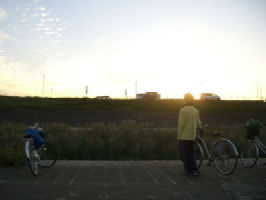

遅まきながらブログが開設しました！

秋公演本番まであと十日！

え？

十日ぁ？！！

そうなんです。
２００６年度万絵巻秋公演「WiLL」までもうそろそろです。
今回は１年ぶりのオリジナル台本、初の-IST\[イスト\]零番舘という場所。
超・久しぶりの１回生の演出さん、と新鮮さ抜群な公演なのです。
というわけで、当ブログでは秋公演期間中は強化期間として、
秋公演の様々なあんまり重要でない情報を逐次追加していきます！
今日は昼からは芥川河川敷にて練習をしていました！

いやあ…

いいですねぇ…

快晴の中での練習はとっても清々しかったです。
練習中の写真？そんなのはどうでもいいんですよ。
こんな感じで着々と練習は進んでいくのです！

**・今日のWillその１**
（色んな人に今回のお芝居「Will」って何かを体で表現してもらいます）

みんなでＷｉＬＬ！
