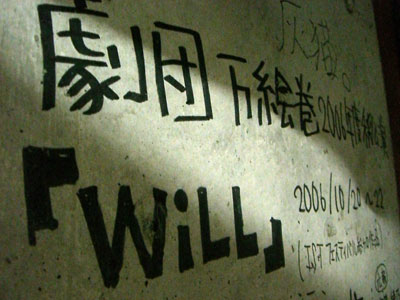

関西大学劇団万絵巻2006年度秋公演「WiLL」は全日程終了しました。
ご来場下さった皆さん、本当にありがとうございます。
というわけで最後の最後に、作・演出をつとめた“ささのは”のご来場くださったお客さんに向けてのメッセージを、ブログに載せさせていただきます。

ただし！

インタビューをしたのが打ち上げ中なので、
かなりよくわからないテンションとまとまりの無い文章になりました。
それを十二分に考慮の上にご覧下さい。

では。

ささのは「えっと、

万絵巻秋公演の「WiLL」はかなり思い入れが深いです。はい。

ありがとうございます。ほんとに来ていただいてうれしいです。

あ、酔ってます。すいません（笑）

…えっと、すごく苦労してみんなで泣いて笑って作りました。

もう、ほんとに色々ありました。

なんかもう、もうすごい経験できたと思います。経験値かなり高いと思います。

ああ、まあ役者もやりたかったですけど、演出…作演出来てたのかな（笑）

とは思うんですけど、まあ自信とかそういうのは余所にして、

私はこれが出来て嬉しかったです。

お客さんも楽しんでくれたらほんとにほんとにこの上ない幸せです。

はい。ご来場いただきほんとにありがとうございました。

まとまりません。すいません。」

・
・
・
以上！打ち上げ会場からでした！！！！
それでは最後に重ね重ねですが全万絵巻メンバーを代表して、
秋公演に関わってくださった皆様方、ご来場下さったお客さん、
その他万絵巻に関係するすべての皆様へ！

**ありがとうございましたー！！
**

**最後のWiLL**

