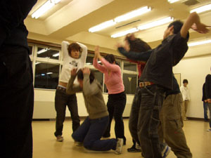

今日の稽古場は富田公民館～♪富田公民館と言えば白い粉。床に手を着いたら手が真っ白。地味に嫌ですね～。この白い粉の原因は僕ら万の前に使用してたダンスサークルにあるらしい。まぁそんなことはどうでもいいや～へへ。

今日は最初に第二景！○リ○○カッコイイぜ！羨ましいぜ！（あんまり言わない方がいいよね？）僕らはプロローグを考えてた。うーん…どうしよ…って感じッスね！
続いて第四景の終わりを練習してかいさ～ん。

リトルセブンとレッドローズはその後公園でれんしゅ～。良かった！だんだんやりやすくなってきたよ～へへ。

うーん、こんな感じかな～よし！以上、稽古場日記でした～へへ。

Presented by 役者(SHOGO)
