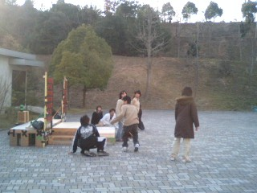

今日は晴れてましたが微妙に肌寒い外で練習をしました。春休み中の大学ですv

本番さながらの(？)舞台を組み立て、セイウチの舞いや「い～と～巻き巻き♪」でお馴染みのあの曲をバックにゾンビる練習にも力を入れてた…らしいです！
何を隠そう、私は音響なので、その時は運悪く場を離れて作業しておりました…。
なので若干語弊があるかもしれませんね…！ええ、若干www

本番まであとちょっと！音響は舞台全体を盛り上げるために実は地味に頑張ってますよー！
衣装に引き続き、音響もマジシャンド城を贔屓してるような気がして心配ですが…いや、でも大丈夫でしょう！
リトルセブンはやる時はやる奴らですからね！w

Presented by 音響
