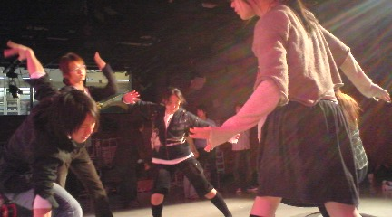

履修ガイダンス２日目終了。
明日は最終日です！！

＊＊＊＊＊＊＊＊＊＊＊＊＊＊＊＊＊＊＊＊＊＊＊＊

【今日のよろづ】

外が極寒だったので（ほんまに４月!?２月並っ!!ﾌﾞﾙﾌﾞﾙ）
今度、公演をやらせていただくＣ棟のスタジオに非難。

今日は「セブンボーズ」という基礎練習の一環のゲームをしました。
「１！」「２！」「３！」…と１人ずつ数字を順に言ってポーズをとります。
７のつく数字と７の倍数は「ボーズ！」と叫ぶのです。
意識の分散が必要になります。
ちなみに私はめっちゃ苦手です!!（苦笑）
でも楽しいから好き（笑）

今回は勝ち抜き選をやりました。
負けたら、円から抜けて外から見守ります。

↑こんな感じ。

たまに妨害もします（笑）
目の端に入るようなところで、めっちゃ変なポーズを…
かなり気が散りますｗ
でも集中！
