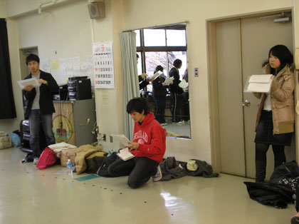
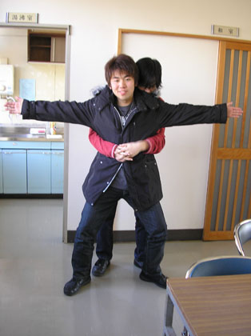

ブログを書くのは初めてで緊張しています、1回生です。
今日も今日とて新発の稽古でした！最初に1回生は新入生紹介用の写真を取ったりしたのちに基礎練。
最近はエチュードがブームなようですよ☆

全力エチュードではバンディさんが「2回生で一番動ける役者」であることを証明してくださいました！！

そして台本練習に入ります。今日からばみってます。
(ばみる＝万絵巻では本番の舞台を想定した目印)
こちらは通称「Aチーム」。（1人欠けてる 汗）

こちらは「Bチーム」

それを見守る（左から）音響さん、演出さん、照明さん。

入りはけが結構ごちゃごちゃしてて大変そうな場面です！がんばりましょう！！

☆今日のおまけ画像☆

タイタニック（笑）

ｂｙ広報
