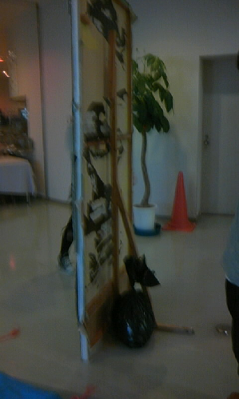

初めての万blog投稿です、

題と内容は一切関係ございませぬ

稲田こと一回生の成分1/4を担っているライスです(「いっかいせい」の変換でないから「いっかいなま」)

ここでは万絵巻のこと書けばいいのですか？

とりあえず順に思い出してみます。

18時くらい。食堂横でAチームに混じって発生、

発声・・・・・・orz......

発声終わって戻る途中ではまつちさんが大道具作業してたので手伝う～

なんか大道具置き場最大8人程イタゾ！なんか盛り上がってる！？

A,Bチームが食堂で稽古してるの横目に見ながらヂョキヂョキ

トタン切るの大変～。アーロン(注1)使っても結構しんどい

あと古い平台をはまつちさんとウェスタンさんとバラした、インパクト途中で電池切れで逢えてのドライバーで分解ｗｗｗ

めちゃ今日大道具に勧誘された(笑)

9時半頃にバスへ、以外に人が多かった。

帰りの電車5人で待ってるときに、自分の腰につけたチェーンに触れるジョイカムさん見て思ったこと。

後ろからみたらどんな風に見えるんだろ？

タクトさん曰く「離れるほどそうみえるで」だそうです

電車の中で

しぃちゃんさんがキム兄の前のチャック(注２)突然下ろしだす

そのあとタクトさんが俺も下ろして的な動きする。

その言い回しがなんともいえないですね、そういうの大好きです。

そのあとしぃちゃんさんがry)以下自粛。

そんなこんなな万絵巻の人達との一日でした。

注１　アーロン＝トタンを切るハサミ
注２　上着のチャックです、わざわざ書かない方が良かったかな？イヤ、しぃちゃんさんに怒られそうだからやっぱり消さない。
