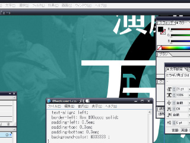

４月でも夜はまだまだ肌寒いですね、台本書いたり広報チーフやってるar9です。
高槻キャンパスはとくに気温の変化が激しいので、服の着方には気をつけましょう。

WEBを見て来てくれた新入生の話を聞いて、僕もテンションやモチベーションが猛烈に上がってます。

万絵巻の広報に入ればWEBやポスター、ビラづくりも経験できます。
Ｃ棟Macintoshの操作方法からPhotoshop、Illustratorの使いこなし方、印刷まで僕たちが一から教えます。
このよろづ広報班からプロのデザイナーになったＯＢさんもいます。
デザインの道を進みたかったらぜひ万絵巻へ！

それと今日は体験稽古にも多くの人がきてくれたようです。
名前鬼やセブンボーズで楽しんでもらえたようでなにより。
ガイダンス期間以降も体験稽古はやっているので、いつでもＳ棟を訪ねて来てくださいね。
ではでは。
