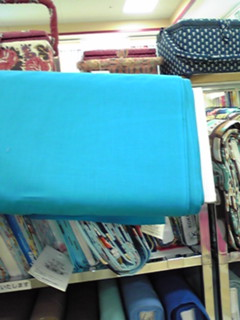

桜もだんだんと咲いてきてますね。
こんにちは。かおりん、こと村上です☆

さて、いよいよ明日から授業が始まります。一回生の方々はどんな感じなんでしょうか。

不安??緊張??はたまたウキウキ??(笑

そんな人もこんな人もせっかくの大学生活!!思いっきり楽しんじゃって下さいね(・∪<)/

そんな中でも忘れちゃいけないのが新歓イベント!!
万絵巻でもイロイロなイベントを企画中です。

お花見・お菓子パーティー・新入生歓迎公演!!

今日も高槻の公民館で公演の練習がありました(>▽<\*)

脚本や広報などを兼ねているar9氏と演出のザキ有馬を中心に、楽しいお芝居が形作られていってます。

今回衣装として参加してる村上は稽古の後に材料を探しに手芸屋へ。

いい色の生地を発見!!
この生地がどんな風に使われるのか…
それは当日までのお楽しみ(\*´艸\`)
