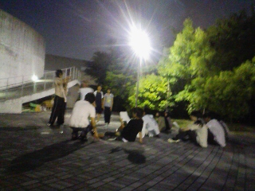

メインの特設ページでも告知しましたが、ＴＣの振替公演となる万絵巻６月公演のお知らせです！

\------ ------ ------

◆演劇サークル万絵巻2009年度6月オムニバス公演◆
『にじいろシアターパーク』

■公演日時
2009年6月27日(sat.)
13:00~16:15
※受付開始・開場は10分前から

■場所
関西大学高槻キャンパス
体育館棟ＴＧ101教室

■アクセス
・JR高槻駅、阪急高槻市駅より
高槻市営バス「JR高槻駅北」５番のりばから「関西大学」行きに乗り、「関西大学」駅で下車。

・JR摂津富田駅、阪急富田駅より
高槻市営バス「JR富田駅」１番のりばから「関西大学」もしくは「萩谷総合公園」、「萩谷」行きに乗り、「関西大学」駅で下車。

※公演当日は土曜日ダイヤなのでご注意ください

■料金
無料

\------ ------ ------

ながらくブログも停止していましたが、ついにブログも再動です！
今日も上回生も新入生も、夜遅くまで稽古頑張っていました！

こちらは上回生、「おまかせ！！　ふしぎちゃん」チーム。
はたしてどんな不思議がとびかうやら！

一方こちらは新入生。先輩が見守るなかの返し稽古、いつもより緊張気味かも？？

本番まであと一週間ちょい、頑張っていきまっしょい！

By　(今回は無職の)養殖クララ教導団
