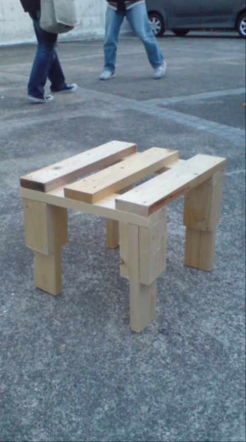

二日連続お邪魔します

演出の梓です

通しお疲れ様です

今日は衣装付でやったのでなかなか雰囲気がでてよかったですね～

ただやはり段取りが多いので脳内シュミレーションが
大事ってことをおもいしらされました

このままラストスパート駆け上がっていきたいです

番長ここにあらわる！

そして、お次は大道具のイタリーです。

音響の返しスピーカー置く為の台を結構前に作りました。

S棟にあったイスを参考に組んでみたら、
人が乗って跳んだりしても大丈夫な強度になりました。

作業の暇な時に特に意味ないけど黒く塗装しました。

公演終了後にイスとして使って頂いたら嬉しいです。

