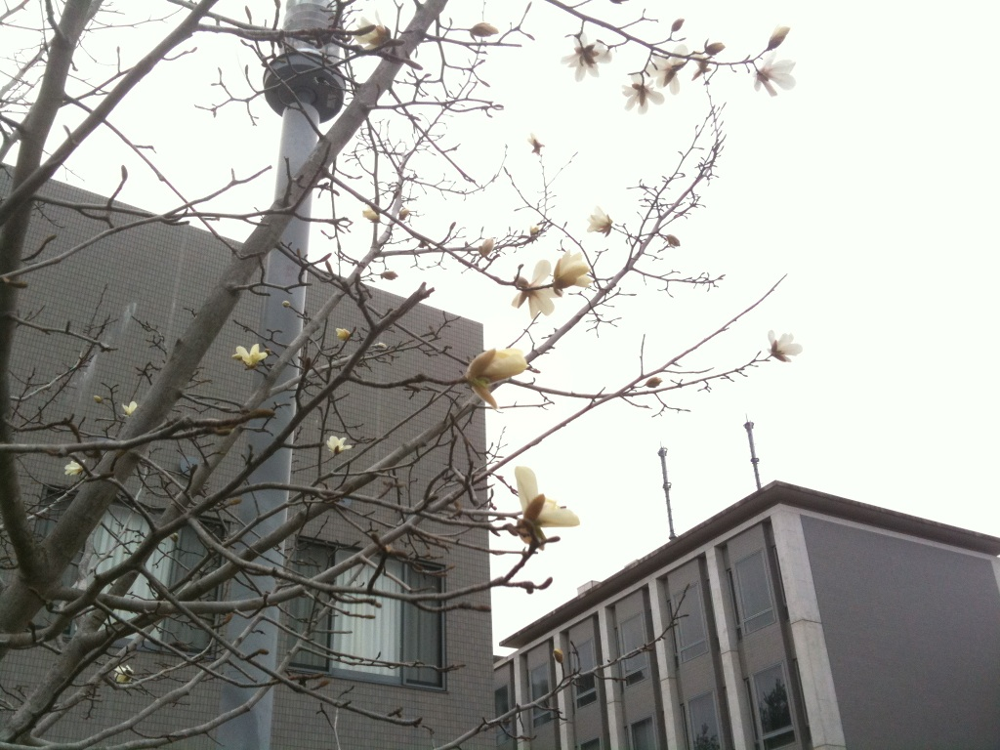

新入生の皆さん、御入学おめでとうございます！

万絵巻では現在、新入生歓迎イベントに向けて、毎日稽古や準備に励んでいます。
ここでざざっと今後の予定をご紹介!!

4月4日(月) 履修ガイダンス
場所:Ｓ棟
時間:10時から17時

→「大学に入学したものの、どういう風に授業をとったらいいの？」という方、様々な授業で様々な経験をしてきた先輩達に聞いてみて下さい!!
単位のとりにくい授業、テストの難しい授業……数々の授業が行われる大学で単位が取れるかどうかは、選ぶ授業によって大きく変わってきます。自分が受けてみたい授業がどんな授業なのか、少しでも気になることがあれば是非聞いて下さい(\*´・\`)
食堂前にあるS棟(スチューデント棟)でやっているので、気軽に来て下さいね♪

5日(火)スイーツパーティー
18時に生協前の噴水かＳ棟に集合

→参加費は無料です！新入生歓迎イベントなので、ゼヒゼヒ遊びに来て下さい(＾＾)
20時頃には終わります。

8日(金)お花見
18時に生協前の噴水に集合

→初めて高槻キャンパスに登校する時、「まさかこんな山の中だとは…」と驚いた人もいると思います。だけど！山の中ならではの楽しみもあるんです(\*^\_^\*)
高槻キャンパスの近くは桜の名所で、毎年春になると桜がとてもキレイ!!これは花見をするしかない!!
ということで…夜桜を楽しんでみませんか？
こちらも参加費無料☆21時頃までありますが、好きな時間に帰れます!!

14日(木)新入生歓迎公演
場所:スタジオ棟
時間:1st 11:00～ / 2nd 13:30～

→万絵巻が普段どんな活動を行っているか…百聞は一見にしかず！演劇サークル万絵巻の新入生歓迎公演です。
公演時間は30分程度なので、お昼休み・授業の空き時間にどうぞ☆
来てくれた方には、新歓コンパのタダ券を差し上げます！

15日(金)新入生歓迎コンパ
18時に生協前の噴水に集合
料金:500円。公演を見に来てくれた人はタダ

→新歓コンパです！是非来て下さい＼(^O^)／
