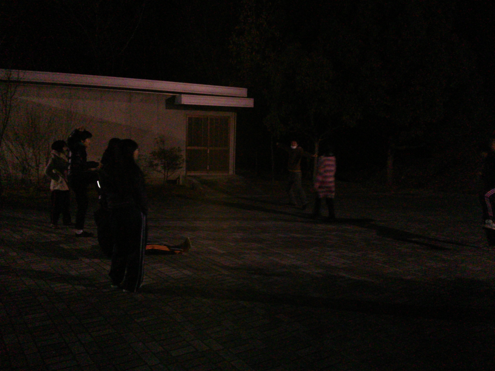

まだまだ寒さが続く今日も山の上の学校稽古でした。

外からＳ棟に入ると誰かしらいるし明るいし温かいしなにかこう、ほっとしますねー

稽古は段取りづけもはじまり徐々に本格的に形になってきつつあるんやなぁとわくわくしております。

が、
セリフはまだ覚えれずカミカミ、動きはガチガチ、こんなんで自分大丈夫かい、心はバクバクな日々を送っております。
まあ、どうにか向上心を忘れずがんばろう。

写真は基礎稽古で体で銀河系だか太陽系だかを表現しそれを外野が見ている、という図でございます。暗くて見づらい点はお許し下さい(^\_^;)

そして本日私ミューズ民一回生あーみんが、お送りしましたm(\_ \_)m

皆、気合い十分やる気十分で毎日取り組んでおりますので3月2日3日はぜひぜひ予定をあけといてくださーい♪♪
