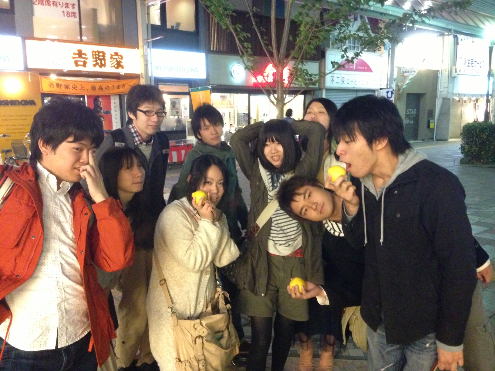

おはようございます。
こんにちは。
こんばんは。
これだけ言っておけば大丈夫なはず…あ、3回生のふぶきです。お久しぶり？です。うん。

さて、今日の稽古では一回生のみんなにむけて音響講座なるものを開きました！
実際に機材を操作してもらい、ランダムに流れる曲や効果音に合わせてエチュードを行う音響エチュードとかやりました。僕は大阪城やりました。意味がわかりませんね。僕にもわかりません。

高槻キャンパス祭まで三週間弱、一回生も前座に向けて頑張ってるらしいので、上回役者組もより一層気合を入れてシーンを返していきますよー！( \*｀ω´)
ではまた！

ところでタイトルのはるかは写真(稽古終わりに撮影)にうつってる柑橘系(たぶんゆず)の名前だそうです。4回生のしゅーぞうさんが500円で買ってきてくれたそうです。以上です。
