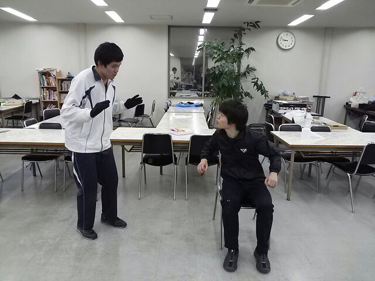

一月も半分過ぎておりますがいかがお過ごしでしょうか。
どうもアキラです。

私も去年の今頃はセンター試験がーとか言っていた気がします。

出雲こと出雲大社君も言っていましたが月日の経過は早いものですね！

さて、今日はスタッフ会議！
チーフ兼役者がたくさんいるので
必然的に稽古の参加人数は少なく…

しかし！人が少なくとも！テンションはいつも以上に高かった！

ということで今日は基礎練を中心に行ったのですがその一つとして

エチュード(即興劇)を2分行う
→同じ内容を1分に凝縮
→更に30秒に…
→15秒、7秒、3秒…
という形式でエチュードを行いました！

「物語の要点をしっかり抑え、凝縮していく」という作業に皆てんやわんや！
しかしとても楽しかったです( ´∀｀)

一回生主体となって行う新人公演発表会、色々突き当たる壁はあると思いますが頑張っていきます( ・∇・)

それでは！

P.S. 写真は基礎練中のらむ君とチャーリーさんのかけあい風景です。
何を言い合っているのかは皆さんの想像(創造)にお任せいたします♪
