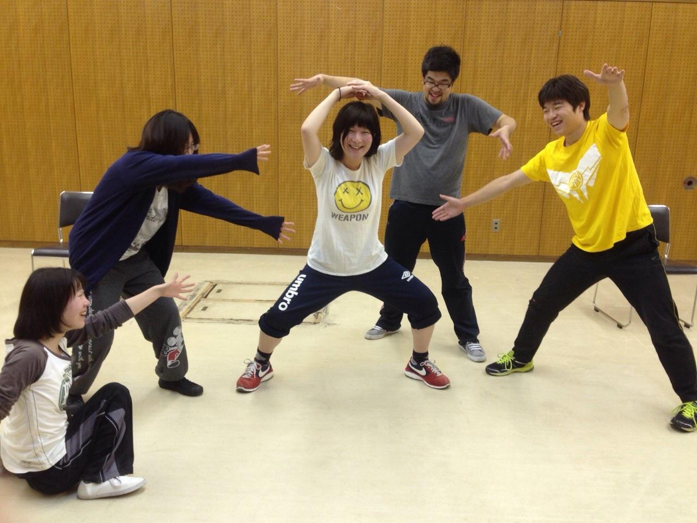

こんばんは！
4回生のくみちょーです。
卒業公演では役者などやらせてもらってます。

今日はですね、小屋見学と通し稽古をしました。
でも今日は唐突に後輩について書きますね。

私ごとですが最近無事22歳になりました。いやー、一回生とか18歳の若さとか可能性すごいですね。孫みたいな感覚です。

自分にも大学1回の頃があって、先輩達が「若いねー...！」っていってた気持ちがよくわかります。

三回生とかになると長く過ごした分、可愛いだけじゃなく憎たらしい面も見えてきて、でも結局皆可愛いですね。

「まだまだ負けんぞ！」と思うこともあれば、私なんかすごい技術もってる奴らばっかりで「すご...負けた...師匠だわ...」とも思います。

三回生を見ているとこの子たちが次世代担ってくんやろなと、世代交代だと、おもいます。
後輩だけどライバルのようで師匠のような感じです。感覚的に。

学生劇団なので、皆とずーっと一緒にお芝居をやれるわけじゃないです。とても悲しい運命です。

でもね、めっちゃ好きな奴らと最後の芝居やるなら一生忘れられない舞台にしたいです。

気恥ずかしいですが、今回くらいはこれくらい書いても良いかなと思います。

ではでは、皆様12/12.13.14に大阪市立芸術創造館にてお会いしましょう！！

脚本の題名なぞらえて、忘れらんねぇ舞台つくるぞー！ご期待ください！
