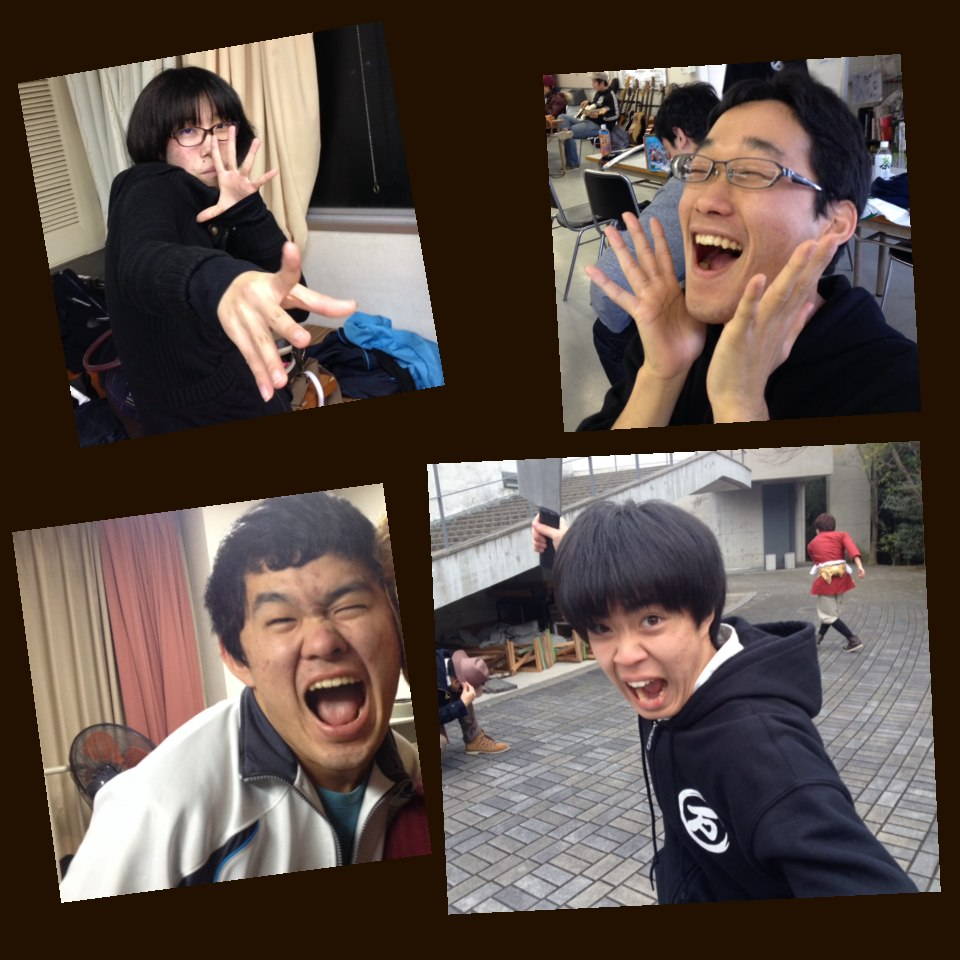

左上:もっさん 一回生
返事がハキハキしてるザ・後輩ちゃん。
夢はポケモンマスター！多分。
今回、小学生~おばあさんまで、演じ分けます！

右上:キャメロン 二回生
（塾の先生役)
普段はクール。
しかし、舞台に立つとお調子者に変身！怒りの表情が苦手の様子。
今回、役作りバッチリです(意味浅)

左下:らむ 二回生
先輩に揉まれて生きてきた万絵巻のギャグマシーン。
秋公演ではプリングルス役でした。
果たして今回は真面目なキャラクターを演じるのか！？それとも...！？

右下:夜王 一回生
常に喋り方がだるそう。
だから、とある台詞に苦労しました。
笑顔が素敵な青年です。
地毛ですが、頭の一部が茶髪です。
