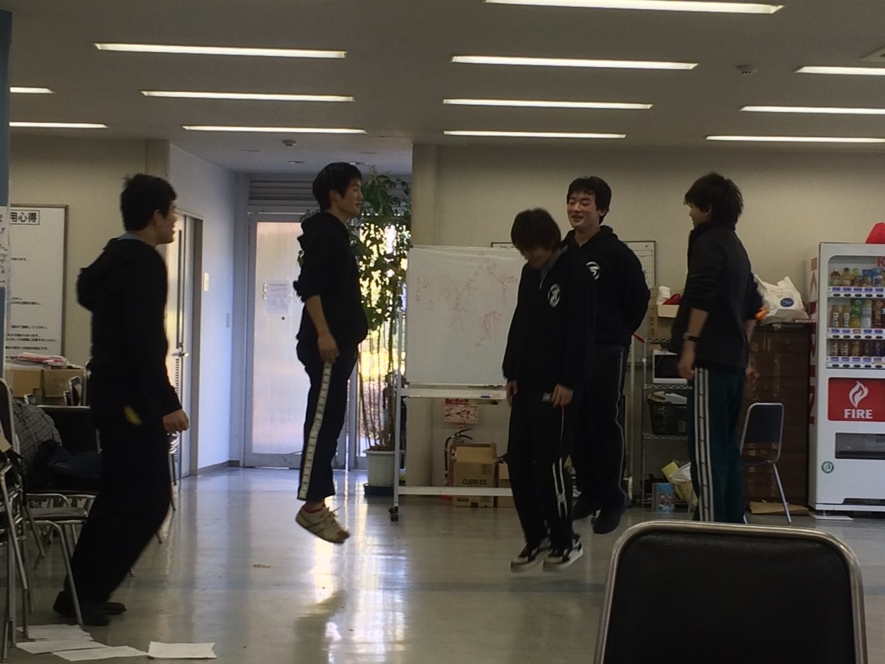

皆さんこんにちは。２回生のらむです。

今日は何人かで念力の発動に挑戦しました。(嘘)

左脳辺りに力を込めて、シナプスの信号を力学付与関数に基づき、踵から爪先にかけて均等に付与させて 写真の通り、なんとか浮くことが出来ました。(嘘)

僕は最近、体重が増えたので自己水平抵抗軸の調整がうまくできず、浮き続ける事は出来ませんでした。

スナフキンは序盤から上手く浮くことが出来、最終的に70㎝位浮いてました。彼は時空干渉力が人よりも強いと思います。(嘘)
僕もいつか浮けるようになるように頑張りたいです。

では冗談はここまでにして、
(長々とお付き合い頂きありがとうございます。)

今日はテスト習慣の間ですが元気に朝から稽古しました。
みんなテスト疲れや朝早起きによるの疲れが溜まりに溜まっていたので、ラジオ体操第一をしました。さすが民放で流れているだけあって、楽しいしなんとなく体も元気になりますね！(^^)ラジオ体操万歳(^O^)

そして本日は役やシーン、台詞等をそれぞれ話し合い、劇の中身をつめる事をしました。
こーいうのが来ると、ついに公演期間も中盤に差し掛かってきたのかなぁ、と思います。
楽しみだったり怖かったりしますが、今はただ今出来ることを必死にやるだけなので僕含め役者、スタッフ共に頑張っていきます！
とりあえず一番の目の前はテストなのでまずは単位を取るために奮闘しようと思う、文武両道が座右の銘かもしれない らむ でした！
