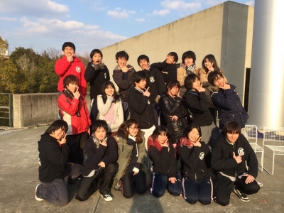

ホロ「どうもこんばんは、ホロです」
ほのか「ほのかです！！」
はちを「はちをです」
大和「どもども！大和です(＊´∀｀)」
エーデル「エーデルです。」

ホロ「本日最後の稽古ということで、小屋入り前の仲良し5人組の会話をお送りしたいと思います！しばしお付き合いください！」

ホロ「今日は最後の稽古でしたねー」
ほのか「もう最後とか…」
大和「ねー(´・ω・｀)早い…」
エーデル「ついこないだ役者選考してたのに(笑)」
大和「それなww」
はちを「でも中身は濃かったね」
ほのか「やねー」
ホロ「そうやなー」

大和「今日って何しましたっけ？」
エーデル「ひたすら長回ししましたねw」
ほのか「もう最終確認って感じですよ」
大和「あ、あと、基礎練で全員エチュードやったよね！お題『コズミックラテ』で！」
ほのか「展開が奇想天外すぎてww」
エーデル「『コズミックラテ』とは一体なんだったのかって内容だったよね…」
はちを「※劇団赤鬼のコズミックラテとは一切関係ありません。ご了承ください。」
ほのか「wwww」
大和「ワロタwwww」
エーデル「我々は若かった」
大和「基礎練から稽古終了までコズミックラテ一色でしたなw」
ほのか「みんなの仲も深まったしw」
大和「なんだかんだでめっちゃくちゃ楽しかったなー(＊´∀｀)！」

大和「やっぱり今日で最後とかまだ信じられないわ…」
ほのか「そんなこと言っても、もう明日から小屋入りですよ。みんな今までの稽古振り返ってどうです？」
エーデル「まさかこの期間にインフルエンザになるとは思いもしませんでした…。」
ほのか「エーデルは新年早々インフルにかかってたなw」
エーデル「文字通り寝正月でしたよwwwでもやっぱりこの2か月楽しかったなあ…」
ホロ「そうやねー」
大和「いろいろあるけど、個人的には稽古人数4人事件が印象的でした←」
ホロ「え？なにそれ知らない…」
エーデル「私らいないときや…」
ほのか「自主練習の時の話や」
はちを&エーデル「in バイト先」
大和「たまたまみんなバイトとか用事が重なった日で、その4人が合うシーンも無くてめっちゃ焦ったw」
ホロ「初耳だわwww」
大和「いやでもほんま楽しかったなー…充実してた…」
ホロ「やなー、稽古終わって皆残って自主練もたくさんしたしなぁ…」
ほのか「稽古1時間前の朝9時とかに集まったり、夜遅くまで練習したりね」
ホロ「迷走とか暴走とか一杯あったけどwww」
ほのか「それはそれでいい思い出やってww」
ホロ「朝弱い人には痛手みたいやったけどwww」
エーデル「遅刻いなかったから大丈夫！」
大和「(;´・ω・)←朝の弱い人 …でも、朝練も居残り練も本当やってよかったよね！」
エーデル「あとは本番で練習の成果を発揮するだけというやつですね」
ほのか「そうですな！！」

ホロ「あと2日したらもう本番なんですよねー」
大和「うわぁ…実感ねぇ…」
ほのか「でも、この2ヶ月間みんなで頑張ってきた成果をやっと出すことができる！！そう考えたら嬉しいよね」
エーデル「緊張してきた(；゜Д゜)」
はちを「大学の単位の一部を犠牲にしてまで稽古に打ち込んできた訳やし成功させたいね…！」
エーデル「単位の話はやめるんだ！…いっちょかましてやろうぜ！！」
ホロ「今までやってきたんだから自信をもってやりきれば絶対成功できるよ！」
大和「全力出しきって、みんなで1つの素敵な公演作ろうぜ！！！」
ほのか「こっからが本番じゃい！！」
ホロ「2ヶ月間皆本当にがんばったよね…すごく仲良くなれて、なんかいいよなこの感じ…みんながんばろ&#8252;&#65038;」
ほのか&はちを&大和&エーデル「おー！」

ホロ「じゃ！このままじゃ終わりそうにないのでここらで打ち切りますか！

こんな感じで仲良し五人組がメインでお送りする劇団万絵巻2014年度新人発表公演『コズミックラテ』、ぜひぜひ足をお運びください！」

ホロ「せーのっ…」
全員「「「「「お待ちしております！！！」」」」」

ホロ「お付き合いありがとうございました！」

(今日の写真は、新発記念の一枚！集合写真です！宝物！∠( ゜∀゜)／シャキーン！)
\----

(書記：大和)
