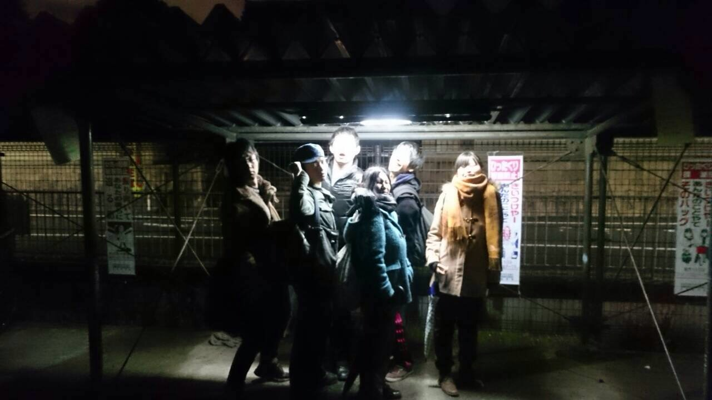

どうも。
二回生のスナフキンです。
ようやく寒さも和らぎはじめましたね。もうすぐ春です。新学期です。

ちょうどこの時期は国立大学の前期入試や私立大学の後期入試があり、受験生にとっては忙しい時期になります。体調には気をつけて頑張ってほしいです。

さて、我々万絵巻は新入生歓迎公演の稽古をスタートさせました。
思えば自分も大学生になって早2年。演劇も全くの初心者でした。でも楽しくやっています。演劇やるなんて思ってなかったです。本当。
何があるか分からないものです。

観てくれる新入生に、演劇おもしろそうだな！って、ちょっとでも思って頂けるような公演にします！
それでは！

iPhoneから送信
