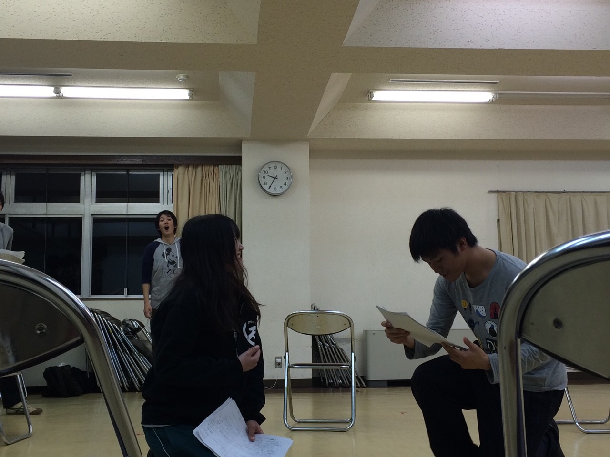

こんばんは！
今回この新人生歓迎公演で舞台監督をやらせていただきます、さとしです！
なかなか稽古に来ることができなかったので、自己紹介が遅れてしまいました。

今日はたくさんのスタッフ、万のOBさんたちが来てくれて、稽古のアドバイスをしてくれたり、指摘してくれたりで、役者にとって充実した稽古になったと思います。
明日は今日できなかった荒通しをします。役者のみなさん、ガンバです!!

下の写真は稽古の風景です。真面目に取り組んでますね！え、背景に変顔した人の姿が見えると？多分おそらく気のせいでしょう（青空シアター「近未来と法」お疲れ様でした！）。

僕はこの万に入って約2年が経ちました。僕は万に入る前は、演劇というと役者のイメージしかありませんでした。しかし、入ったあと大道具や小道具、制作、広報といった色々な裏方を見て、公演ひとつやるだけでも、そのたくさんの役職や人達のおかげでできていることがわかりました。そして、そのみんなで創り上げる感じがとても好きになり、今とても楽しいです！
新しく入ってくる後輩たちにもこの楽しさを伝えるためにも舞台監督を頑張っていきます！
