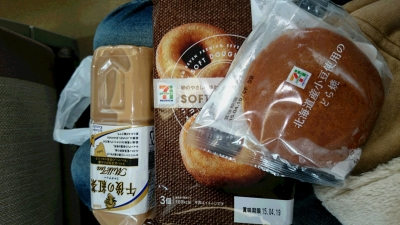

　おはようございます！いや、こんにちわの方がいいかな？万絵巻一回生のジミーでございます。

　春だというのに1月のような寒さが続いておりますが、皆さんいかがお過ごしでしょうか？
　寒いけれども、「春眠暁を覚えず」私ジミーはついつい暇があれば夢の世界へ旅立ってしまう毎日です。

このブログも実は昨日書くはずだったんだけれど、気づけば翌日の昼にアップされてるよ。なんでかな～「なんだかよくわからないものに溢れてるから、この世界は美しい。」なんてね(笑)

　 稽古場にはやっと一回生が旅行から帰ってきました。この時期稽古場にはどこぞの旅行から帰ってきた人達がふらっと稽古場に訪れお土産をバラまいて下さるので食には困りませんね(笑)太る一方です。
(お土産を下さった皆様本当にありがとうございました。美味しゅうございました)

　 　新歓稽古もいよいよ中盤に差し掛かってまいりました！気持ち新たに気合入れていくぜー！待ってろ新入生！！

　 　以上、万絵巻の暴走/列車ジミーでした~

　 　写真は今から稽古場までの道中に食べる僕のお昼ごはんです。
