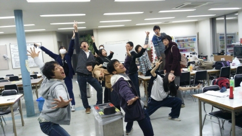

こんにちは、三回生のうみです。
冬服を仕舞い、春服を出し。長期休暇で使わなかった勉強道具を鞄に入れ、窓を全開にし、新しい風を感じて、春の到来を感じていたのがつい一週間前。
なんでしょうね、ここ最近の雨と寒さは。

絶対、稽古場の誰か一人は風邪をひくだろうなーと思う気温の変動でしたが、思いの外みんな元気です。
体調管理が出来ている！当然の事なのですが、誇れる事ではないでしょうか。
C・Cの稽古場は、皆が当然のことを現実にしているから、好きです。

昨日は通しでした。
残り少ない稽古日数で何をすべきか、役者・演出・スタッフ共に肌で感じれたのではないかと思います。
本番まで、使える時間が少なくなってきましたが有意義なものに出来そう。

最後に宣伝を。
今日、万絵巻ではイベントを行います。
お菓子を食べながら、お喋りしませんか？
新入生の方、是非お気軽に。
