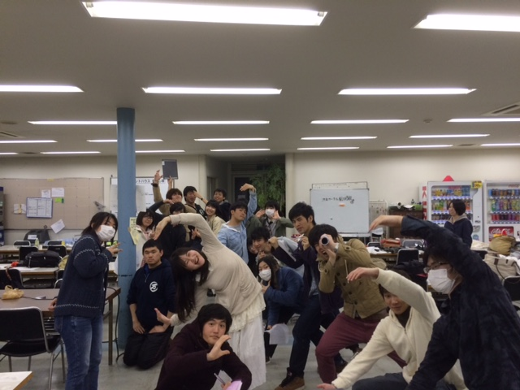

どうもこんにちは、つい最近二回生になりました、りんでございます。

雨が降ったり止んだり、寒くなったり暖かくなったりな日々が続いておりますが皆様風邪などひいていないでしょうか？
特に高槻キャンパスは寒いですからね！地元は暖かくても油断は禁物ですよ！
体調管理大事！！！

さて、昨日はラスト通しでした！
以前の通しより確実に良くなって、見に来ていただいた方には褒められることが多くなりました！嬉しいですね！＼(^o^)／
通しの度にだんだんダメ出しが少なくなっていくと自分の成長を直に感じますね…！

あと稽古日数も残り1日！
さらに良いものに仕上がると思いますので、できるだけたくさんの新入生に見てもらえれば嬉しい限りです(\*^^\*)
