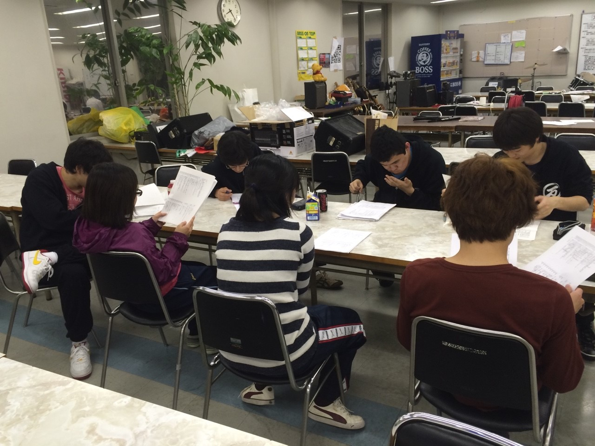

どうも、3回生の出雲です。
新歓公演も終わり、TC公演の時期へと入りましたね。
今回は制作チーフとして、より良き公演になるよう頑張っていきたいと思います。
さてさて！昨日の稽古は役者選考を行っておりました！みんなテンション高く楽しそうに台本を読んでいて、今回役者じゃないのが死ぬほど悔しいレベルです。クソゥ
写真はそんな選考です。

さて、ここで新歓イベントの宣伝をば。
万絵巻は本日新入生歓迎交流会を行います！時間は高槻キャンパスが18時にS棟、ミューズキャンパスが18時半にミューズ食堂前です！持ち看もいるので場所がわからないって方は一声おかけください！
お腹一杯食べれるのでお腹がすいたなぁって人も是非！
以上、出雲がお送りしました！
