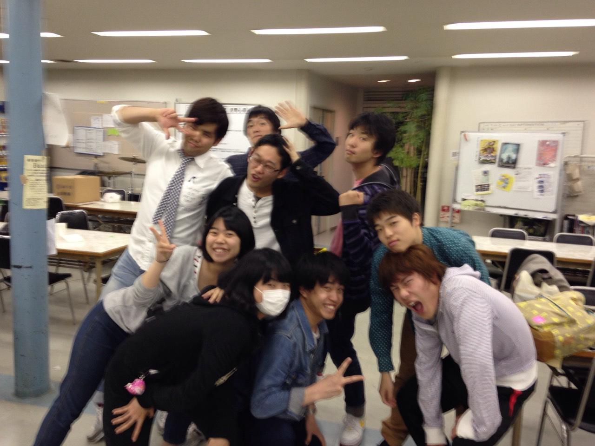

どうも、最近鼻血と戦うことが多くなってきた4回生の散葉です。
電車で一張羅着てるときに出ないでほしいです。まじで。

そんなこんなで、今日の稽古ではブレストを行いました。
ブレストって「ブレインストーミング」の略だって知ってました？
私は最初、ブレイクストーリーの略だと思ってました。

時代背景やキャラ設定など、
思っていたより演出とのずれがあったり、面白い解釈が次々と出てきたり、
なかなかに有意義で楽しいブレストでした。

これからゴールデンウィークに突入しますが、万絵巻は休んでなんかいられません！
劇を面白くするために、頑張りますよ！

え、わたし？ただいま車で九州に向かってます。
お土産はひよこまんじゅうかな。
