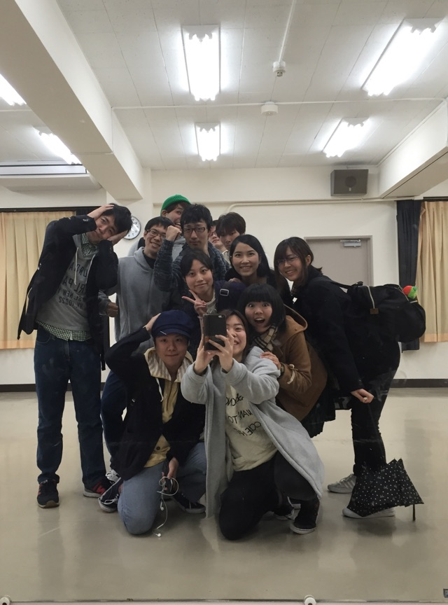

本日はあいにくの天気で雨が降ったり止んだり…

私は雨があまり好きではないので少し残念な気持ちでした。

が！しかし！

我ら万絵巻の稽古でそんなこと言ってたら置いてかれます！！！外が雨だろうが気持ちは晴れ晴れ元気が一番です！

新発期間に入り、さらに後輩が可愛くなった気がすると共に先輩として何を教えられるかと考えさせられます。教えるの得意でない私はなんかこんな感じといったふわふわしたものでしか教えられないので不甲斐ないと思いながらそれを必死に聞いてくれる後輩たちには自分も頑張ろうと思わされる日々です。

うん。頑張ろう。( ・ㅂ・)و ̑̑ グッ !

今日は13期生のねこさんが来てくださいました！勉強になるなる…自分たちにない発想をくださるので本当に有難いです！！

後輩たちの必死に頑張ってる姿を是非是非みなさんに観ていただきたい！！

ではでは、ちょっといつもより真面目にブログ書いてみたほのかでした。
