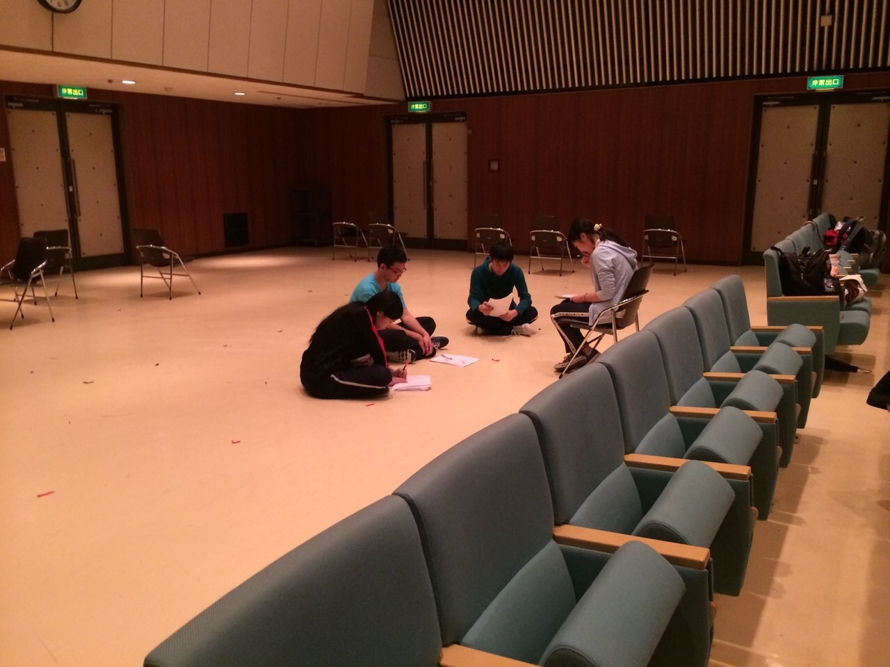

こんにちは！
最近万年筆が欲しくてたまらないあおいです。
パソコンが壊れたことで、年賀状70枚の宛名を
全て万年筆で手書きしたことが懐かしく
思い出されます。
そして万年筆のペン先を破壊したことも
今となっては懐かしき思い出。

さて、今日は最初に柔軟をして、エチュードをしました。
私は恐ろしく身体が硬いのでどうにかしたいですね。
そしてエチュードは落ち葉をしました。
自分自身、先輩や同期に少しでも近づく為に
精進しております。

演出となってはや数週間。
演出がどれほど難しくて大変であるか痛感しております。
先輩方にアドバイスをいただきながらもがいています。
何よりも言葉で伝えるのが難しい。
私は理系だからと言い訳をしてみますが、
理系でも文章力は必要な訳であり、
今まで逃げてきた結果、現在語彙力のなさに
悩まされている訳です。

題名の「柵なら飛び越え、壁なら砕け」というのは
中高時代の友人が書道の課題で書いた言葉。
いっそのこと柵も砕きながら素敵な公演と
なるよう、頑張ります！

以上、さっきまで音響さんと会議をしておりましたあおいでした！
