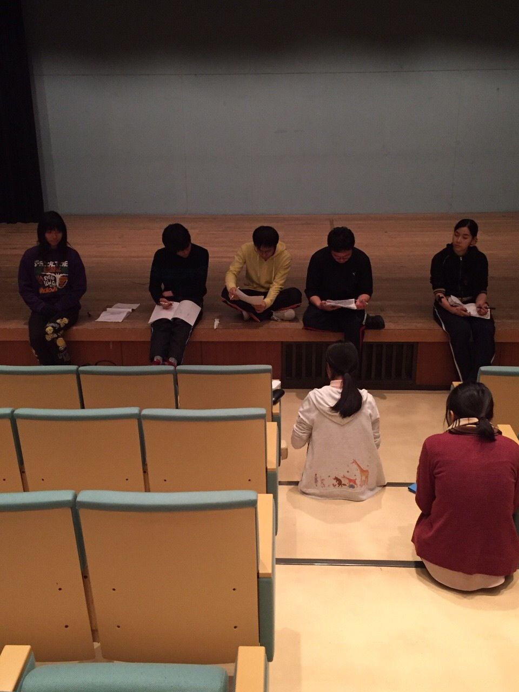

どうも、おはこんにちばんわ。ホロです。
今朝、早朝にふと道をみていると小さな水たまりに薄氷が張っていました。驚きの寒さです。寒くなってきてますので、しっかりと着込んで寒さ対策をしようと思います。カイロは好きではありませんので使わない所存です。

写真は今回の主役である一回生たち！本番までの稽古は実質2週間を切りました！ラストスパートです！
シーン回しでは細かいところを修正し、本番まで更に良いものにしようと全員努力しています&#8252;&#65038;
是非本番を楽しみにして下さいね！

ちなみにですが今回のタイトルは「はくひょう」じゃなく「うすらい」って読みます。こっちのお洒落な感じがしますね。
それではこの辺で、グッバイ&#8252;&#65038;
