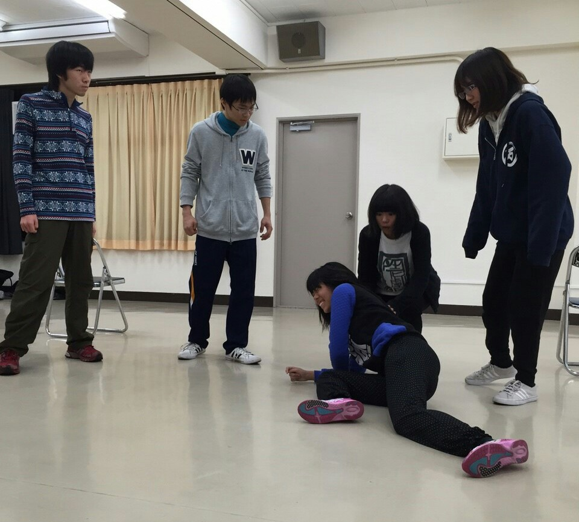

どーも皆様！
本日のブログ担当、ドクトルでございます。
今日は特に前置きもないのでちゃちゃっと活動報告いきますか！

本日は基礎練の後、シーン回し中心に行いました。
各々役について考え、話し合い、実践している役者たちの姿はいいものですね！
熱いです！熱々です！！ヒャッハー！！！
ですがそれと同時に
「あぁ、いよいよ本番が近づいてきたんだな」
とひしひしと感じました。
あ、あとフルーツバスケットも少々…
マイノリティ派の人にとってはツラいですねあのゲーム。

そしてそして、なんと本日の稽古には
第14期生のノリさんが駆けつけて下さいました！
的確な助言をビシバシと役者陣に授けるそのお姿、憧れます！

そんなこんなで我々の新人発表公演まで残すとこ後10日！！……かな？
息切れしない程度に突っ走って行きましょう！

あ、ちなみに今日のタイトルは全然関係ないです。
言ってみたかっただけです。
