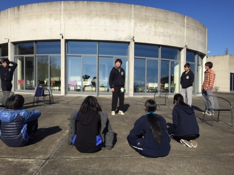

お疲れ様です、おはこんにちこんばんは！
毎日必ず塩キャラメルポップコーンを食べ
遂に60㌔の大台に乗りましたベルです！

昨日は基礎練からの回生エチュード、
そして本番前最後の通しでした。即興劇に
ついては回生らしさがよく出ていました。
１回生は夏と比べて成長していると
褒めて頂けました嬉じい"！
観る演じるどちらも楽しかったです！
共通事項は"サンタとトナカイ仲悪い"！
通しについては実は２日連続。
間を挟まず数を重ねるのはそんなに
意味がないのではと正直思っていましたが
いざやってみると直ぐに改善出来た箇所が
あったり、昨日と比べて変わっている
という御言葉を頂いたり！
ヒトは一分一秒でも変わっている。
稽古終了後も有志の者達は自主練に励み、
少しでも完成度を高くと精進してました。

ドレスリハーサルも終わり、いよいよ
本番が近いんだなと緊張してきました。
今週末には公演がおわってるなんて
考え難い…確かな事は、泣いても笑っても
時は過ぎる事！出来うる事を出来る以上に
がむしゃらにやれたらなと思います。
私、後先考えず突っ走る事なら得意です。

これまでの日々、振り返ると特に同回生と
本当に近づき親しむ事が出来ました。
しかし身内で仲良く楽しいで終了ではなく
団結力も以て観て下さる方々が充たされる
そんな２日間にします！！！！！

「「ナミヤにかかれば悩み無用！」」
