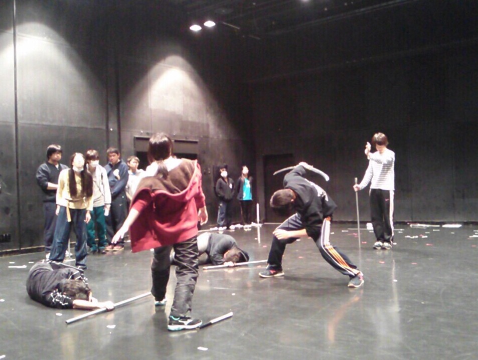

こんにちは！

2回生の如月です！

今回の「野獣郎見参！」では役者をいたしております。

昨日は、大阪市立芸術創造館で通し稽古をしました。

本番と同じ場所で稽古ができるので、みんな気合い十分！！

実際に小屋で練習することで、雰囲気を掴んだり、役者もスタッフもそれぞれ課題を見つけられたりとても有意義なものになったと思います。

殺陣やダンスが形になってきて、だんだんBGMも付いて…と、通し映像を見てテンションがあがると同時に気持ちが引き締まりました。

観に来てくださる方々をあっと驚かせるような、満足してもらえるような、魅せられるような舞台をつくるため、もっともっと上をめざさなくては…！！

それでは！

是非とも2月26日、27日、28日は芸術創造館までお越しください♪
