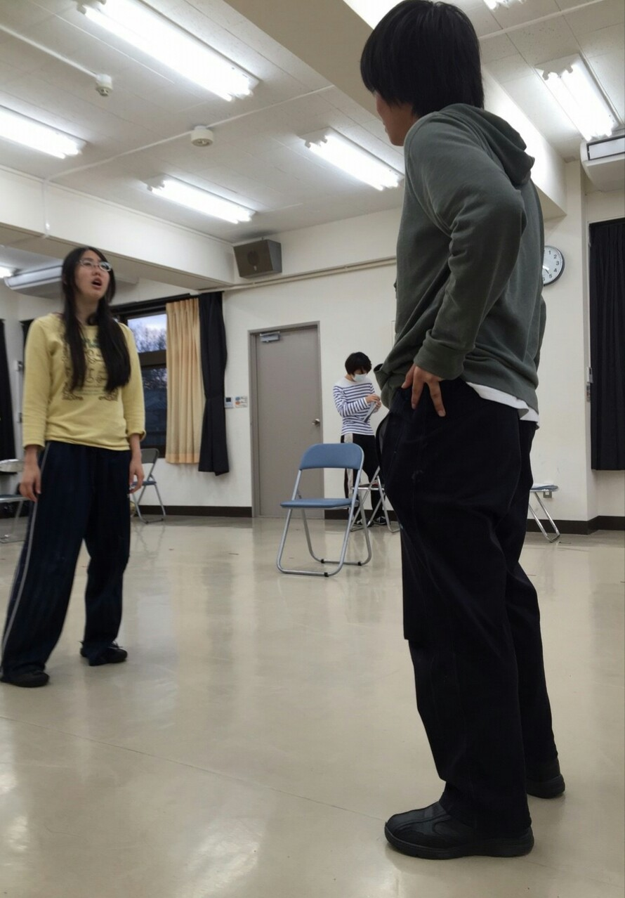

テストが終わるとやっぱり落ち着きますね、会長です。

今回の卒公も役者をやらせていただいていますが、やはり卒公ともなると規模が違いますね。舞台と小道具がすごければ役者として覚えることや考えることも多いです。 今回の稽古時間も長かったのですが、その長い稽古時間でもやることは山積みで絶えませんでした。

飛んで跳ねてと運動量のとっても多い舞台なのでこの寒い季節にはぴったりでホットな舞台になっています。2月の26、27、28日は大阪市立芸術創造館でお待ちしております！
