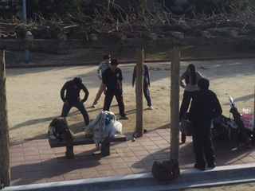

ふと一年前の今頃は何をしていただろうと考えると、受験勉強に自分の全てを捧げていた自分自身の姿を思い出し、時の経つ早さを感じております。

改めましてこんにちは。

今回の担当は照明をこよなく愛する1回生のあおいです。

前回公演である新発では演出を努めておりましたが、今回の卒業公演では役者と照明をさせていただいてます！

初めての卒公でまず何よりも驚いているのは役者の多さ！

中学時代から演劇をしてきた私でもこれほど大人数の舞台に立つのは初めてなのでとてもわくわくしております。

そこに万のパワフルな演技も相まってかなり熱量のある舞台となっているのではないでしょうか？

私個人の話をいたしますと、今回私は久々に役者をしております！

今までに演じたことのない役に挑戦しており、多くの壁にぶつかりながらも日々話し合いや練習を重ねながら精進しております。

そしてやはり体の柔軟性という壁も自分の前に立ちはだかっております。

写真はダンスの自主練での一コマ。

より完成度の高いものにすべく、稽古時間外も練習に励んでおります。

稽古日数も少なくなってきている中、役者それぞれ自分自身の課題と向き合いながらより良い舞台にすべく奮闘しております。

私はどんなに壁にぶつかってもそれでも舞台に立ちたいと思ってしまうんですよね。

なぜだろうと演劇を始めた時から自分自身に問い続けているのですが、答えはまだ出ておりません。

ただ一つ言えることは、私は当日劇を見に来てくださるお客様の表情を見ることが何よりも楽しみなんです。

今回はどのような表情を見ることが出来るのでしょうか？

ダンスに殺陣にと多くの見所のある、

劇団万絵巻2015年度卒業公演「野獣郎見参！」

26~28日にぜひ大阪市立芸術創造館まで足をお運びください！
