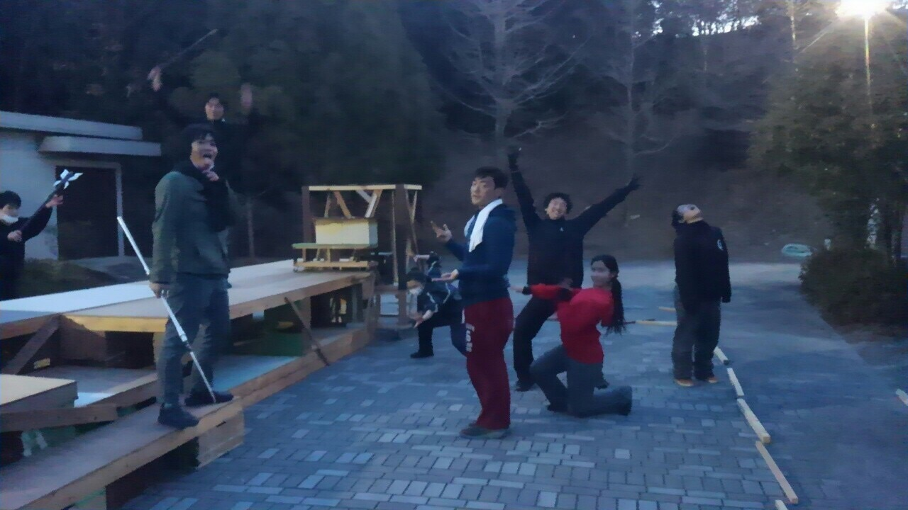

おはようございます、2回生の大和です！
日に日に寒くなる一方ですが、皆様いかがお過ごしでしょうか？

今日の稽古は、ドレリハを行いました！
衣装を着て最初から最後までやる初めての通し！
始まる前からみんなワクワクドキドキでした(((・ω・)))
やっぱり本番の衣装を着たり、着てるのを見るとテンションあがりますね！！
写真は、稽古後、殺陣の自主練に励むメンバー！ドレリハ後でも、いえ、だからこそ、反省点などを細かく修正しながら進めています！

今回の衣装さん、そして小道具さんは、壮絶な作り物の嵐…！
小道具も衣装も、殺陣に使うものから装飾品まで、それぞれの用途や使う(着る)人などを1つ1つ考慮しながら、全て丁寧に作られています！
私も今回、大道具の他に小道具も担当させていただいているのですが、
今日のドレリハでも、衣装・小道具全て含めて、1人1人の努力がしっかり見えるようなクオリティ高いものばかりで、自分ももっと精進しなければいけないと思い、日々先輩や同期の作品を拝見する毎日です。(もちろん、私が作った小道具も登場しますよ！)

今回のテーマは「挑戦」。
私自身、ダンスなどに加えて、いくつもある殺陣や、殺陣に使う小道具など、初めてのことばかりで、覚えることも多くて、とても刺激的な毎日を送っていますが、新しいことを身につけていくことができるその毎日が、最近楽しくて楽しくて仕方ありません！挑戦ってこんな楽しいことなのか！！(＊´∀｀)と思う今日この頃です。

出演者、スタッフ陣、その全員が楽しみながらいろんなことに果敢に挑み続けたこの公演も、いよいよ本番が間近に迫っています！
嬉しいことに、予約もどんどん埋まっていっている模様！
ステージから皆様の顔を見ることを楽しみにしています！
ご予約はお早めに(＊´∀｀)！

では！最近1曲リピートならぬ1コント(1漫才)リピートにハマっている大和でした！(＊´∀｀)

とっぴんぱらりのぷぅ！
