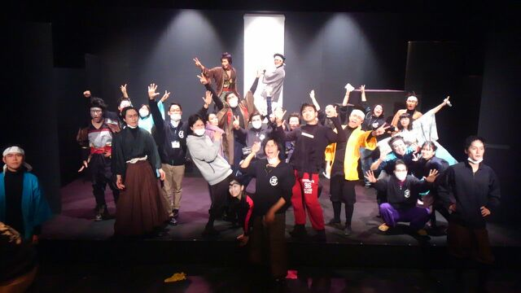

皆様おはようございます。
今回の2015年度卒業公演「野獣郎見参！」の演出をつとめました、4回生のアイルです。
このブログも書くのが最後だと思うと、4年間の色々な思い出がよみがえります。

まずは、全公演大変なご好評をいただき、予約チケットが満員御礼となりましたことをお礼申し上げます。
ご来場誠にありがとうございました。
一般のお客様からOB、OGさんに至るまでたくさんの方に興味を持ち、また会場に足をお運びいただきまして、感謝の念でいっぱいです。

今回の公演は本当に挑戦ばかりの公演でした。
終演した今、怪我人もなく無事に幕を下ろせた安心感でいっぱいです。

スタッフも役者も一丸となり作り上げた「野獣郎見参！」。
少しでも万絵巻の新しい魅力を知っていただけたなら光栄です。

そして、みんな最後まで一緒に頑張ってくれて本当にありがとう。
万絵巻で過ごした4年間は本当に一生の宝物です。
同回生のみんなも、下回生のみんなも、いつも支えてくれてありがとう。
不甲斐ない演出ですが、ほんの少しでもみんなに何かこの公演で掴んでもらえていたら本当に嬉しいです。
最後に野獣郎見参という演目を、みんなと一緒に打つことができて本当に嬉しかったです。
本当に感謝の気持ちでいっぱいです。ありがとう。

それでは、
劇団万絵巻2015年度卒業公演「野獣郎見参！」、終演の挨拶とさせていただきます。
今後の万絵巻もどうぞよろしくお願い申し上げます。

万絵巻19期生
アイル　こと　せな
