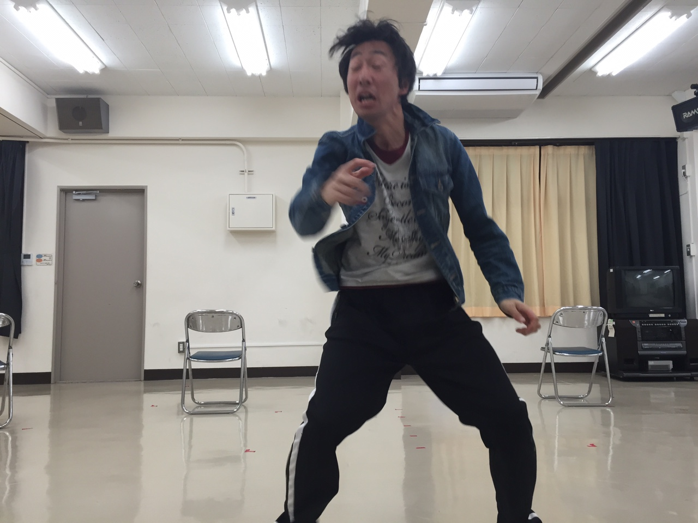

↑罰ゲームで「90秒で分かる天空の城ラピュタをやってるジミー」

　 どうもこんばんわ。クリスペプラーです。
すみません嘘つきました。
2回生のジミーです。
自然が子孫繁栄の為ハッスルし我々には迷惑極まりない日々が続きますが、皆様如何お過ごしでしょうか。

　 万絵巻的には卒業式と追いコンが終わり、四回生の方々がこれで完全に万から卒業してしまいました。なにかポッカリと穴が空いてしまったような気分です。

　 ところで今日はセリフ締め切りでした。皆段取りも台詞もバッチリ ！？……ではないから写真のような事が行われているんですね。
今回はなんと僕、出番多いんです！出落ちじゃないです。だからこそ台詞量も多い。頑張らなきゃ！！

　 新歓まで残り三週間ほど。というわけで本日はラピュタの説明が早く終わりすぎて永遠と金曜ロードショーでやってそうなCMものまねで尺稼ぎをするジミーがお送りしました。
ではではまた明日～デュエル・スタンバイ！！

　 p.s. USJのフライング・ザ・ダイナソー行きたいんですけど、よく考えたら10年近く行ってません。行き"た"い"( >&#65103;< )
