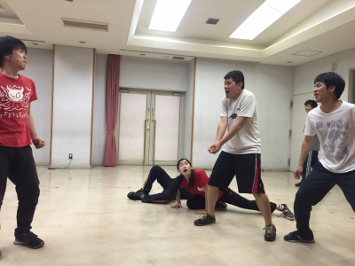

どうも！blog2回目の4回生、出雲です！

今日は暑かったです。半袖がちょうどいい季節となりつつありますね。キャンパス祭の日はきっともっと暑いんでしょう。熱中症には気を付けて。

さてさて、今日の稽古ですが、場展の練習を中心に、昨日の通しで不安だったところをやりました！もっと感情こめるシーン、もっとはっちゃけるシーン、まだまだ詰められるシーンがいっぱいです。

本日のキーワードはそうですね、「タイトル」でしょうか。
ビー・ヒア・ナウ 今ここに存在する 本編とどう関わっていくんでしょうね。

写真はみんなでやったエチュードです。時間設定4分半の中6分半もやった超大作(？)です。
