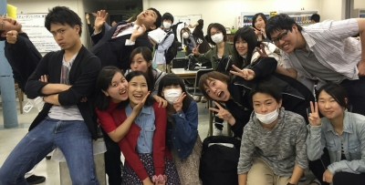

皆さんこんにちは。最近寒暖の差が半端
ないですね。僕の装備はもう完全に夏仕
様です。

さて、昨日の稽古場はといいますと建て
込み稽古を行っておりました！僕は私用
でちょろっとしか見れていないのですが
役者たちの楽しそーな雰囲気がとっても
いい感じでしたよー。自分的な見所は
やっぱりオープニングかと！！
OP厨の自分にはサイコーのオープニングでした！詳細は言えませんがめっちゃ
いいですよ～。

さて、TC公演でもう一つ忘れてはいけな
いのが一回生による“前座”ですね！
こちらも内容自体は自分、全く振れてお
りません！タイトルしか知りません！
なので本番すっっっごく楽しみです。
ちらーっとスタッフワークとかみた感じ
では、おぉ！と思いましたね。
ホントに一回生かい？と思ってしまうよ
うな出来のものを多数目撃してびっくり
してます。

そんなTC公演は5月29日の日曜日！！
お時間ごさいましたらぜひ関西大学高槻キャンパスまでお越し下さい！

キーワード企画は続いてるのかな…
とりあえず僕からは「繋がり」という言
葉です。例え目に見えなくても、遠く離れた場所にいようと、人って結構誰かと繋がってるもんなんですかねー

………あ、ドクトルの提供でお送りしました。
