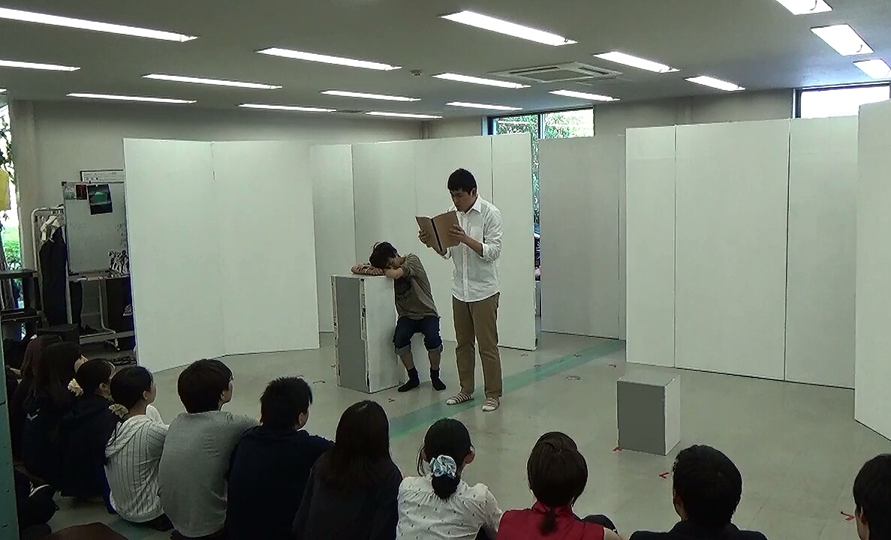

カワバンガ！
最近は半袖で過ごしても違和感が全くない季節ですね。Tシャツ一枚っていうのは楽で好きです。万絵巻3回生のジミーです。

　 今日(もう昨日ですね)は公開ゲネプロを行いました。衣装、小道具、舞台とほぼ本番と同じ状態で舞台に臨みました。

　 一回生は初めて先輩大勢の前で舞台に立つという日でもありました。初々しい。

　 今年でTC公演はジミー的に三年目です。一回生の時にはこの日にパネルに当たって少し事故になって、三年経った今でもイジられ続け、去年はお腹にTシャツ詰めてデブ役やって過去一番のハマり役と言われたり……思い入れも人一倍強い公演だったりします。

　 　今年のTC公演、ずばり「演出」のギミックが凄いです。稽古やってても「はぁーなるほどなー」と思ったりします。

　 　万絵巻の割に今回は少し、お客さんに考えてもらうお話ですが、見たあとは「演劇っていいな」と思わせる仕上がりになっていると思いますヨ！

　そんなこんなであと一週間！！きっと見に来てくださいね♪お相手はジミーでした。次回は恐らく夜王！見るんじゃよ

　 p.s.サッポロ黒ラベルの限定醸造マジで美味かったんでオススメです。エビスマイスターは、まぁ、普通でした。(ジミー的ビールレポ)
