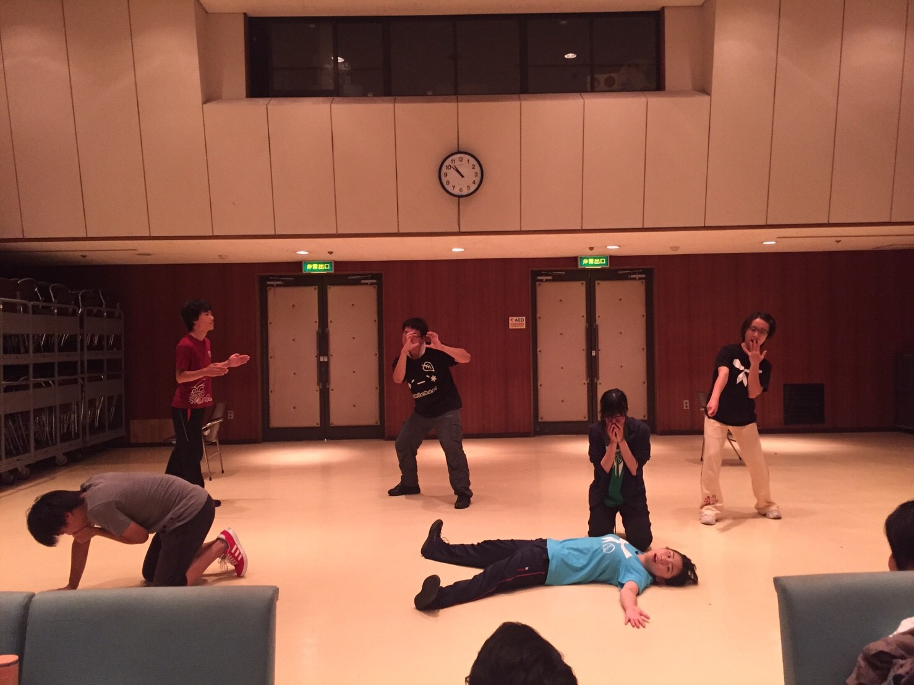

夜になるともうずいぶん涼しい季節になりました。僕の地元ではもう虫も鳴き出して、秋が来たのかなぁと思わされます。

みなさんは近頃どうお過ごしでしょうか。
どうも、やおうです。
今日も万絵巻は秋公演に向けて稽古の日でした！役者発表を終え、遂に、少しずつ秋公演に向けて動き出してます！！

突然ですが、今回の台本は読んでるとすごくエネルギッシュだなと思います。喜怒哀楽が爆発って感じです。演じてても、もう読んでるだけでも元気になれるなって今日の稽古中思いました。
この台本がどんな形に出来上がっていくのか僕自身すごく楽しみです！

それでは今日はこの辺で。
みなさんと本番で会える日を楽しみにしています！その日までどうかみなさまお元気で！

※写真はポートレート。お題は殺人現場です。
