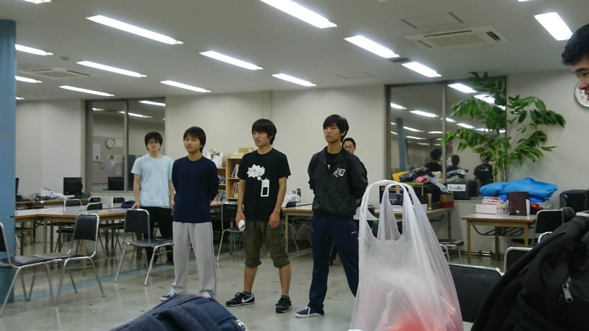

こんばんは！10月31日といえば、ハロウィンです！

なので、飴をあげまくったのですが、

雨も降りまくりました。

稽古なんですが、だんだんセリフだけじゃなく、

動きの段取りも増えていってシーンに活気がついて

いきました。今日声を使わないサイレント

エチュードをしてわかりましたが、動きってやっぱ

大切ですね。もちろん声も大切なんですが、

滑舌が相変わらず悪くて…舌を取り替えたい…。

自分たちがメインとなる卒業公演ですが、過去に

卒業した先輩たちのように1日1日の稽古に励んで

いき、ベストを尽くします。そして、後輩たちに何か

残せるよう頑張ります！

写真は1回生が稽古しているところです。彼らが

どう演技するか楽しみです！

1回生から4回生までが全身全霊でつくる

卒業公演は12/16~18にあります！！

ぜひ観に来てください！！！

以上、4回生さとしでした！

\--
