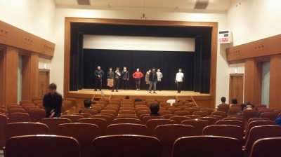

初めまして、二回生のインテグラルです。
今回の劇は柿喰う客ということで、みん
ながしたことの無いタイプの役が勢揃い
という感じがします。今回の恋人として
は無理は、テンポが早く観ている人が
圧倒されてしまう嵐のような劇という
ことを稽古に参加をしていて思います。
こんな嵐のような劇を選んだ一回生凄い
なと思います。挑戦するなあと感じま
した。難しい劇なのに面白く演じられる
一回生を見ていて凄いなあと思います。
一回生が本番を全力で出せるように僕も
頑張っていきたいです。

ところでタイトルにもあるように小屋見
学に行ってきました。真剣に舞台のこと
を考えて、良いものを作ろうとしている
意識が見えました。今回の公演はとてつ
もなく良いものになるなと思いました。
劇に真っ直ぐ向き合ってるということが
伝わってきたからです。先輩としても、
一回生を全力で支えていこうと再度決心
しました。

誰に対して書いてるか分からない文です
が、読んでくださった皆様、少しでも興
味を持ってくださった方には是非観に来
て欲しいなと思っています。最後に宣伝
をさせてもらいます。

【演目】
関西大学劇団万絵巻2016年度新人発表公演
「恋人としては無理」
作：中屋敷法二（劇団柿喰う客）
演出：小田バーグ
演出補佐:ジャンヌ

【あらすじ】
ツアコンに導かれて聖地エルサレムにやって
きた十二使徒たち。しかし一緒に来たはずの
いえす君は行方知れずに。そんな十二使徒
たちはいえす君が見つからない中、それぞれ
の愛の形を模索していく。いえす君を好きだ
から、大好きなだけに……。現代恋愛を十二
使徒というイエス・キリストの高弟で描くハ
チャメチャで切ない片想い系ラブストーリー！！！

【公演日時】
2017年2月
25日(土)18:30～
26日(日)12:00～/16:00～

※受付開始・開場は開演の30分前です
※公演時間は約80分を予定しております

【場所】
茨木市立男女共生センターローズWAM
地下2階ワムホール
(JR茨木駅より東へ徒歩10分/阪急茨木市駅より西へ徒歩5分)

【料金】無料
