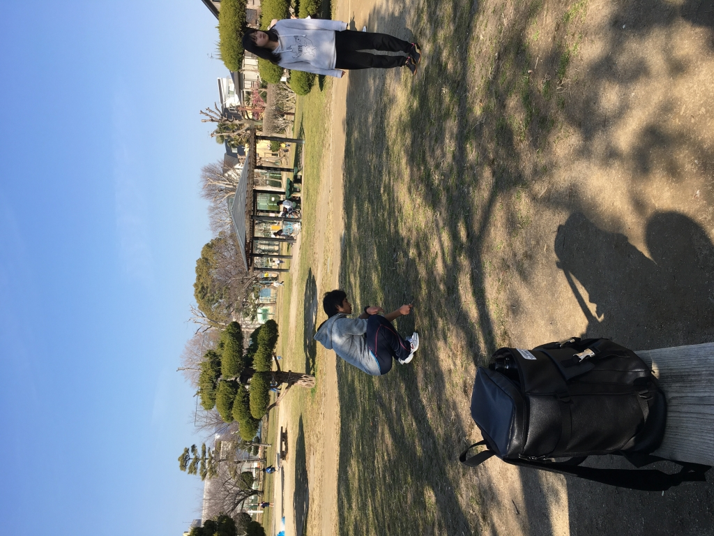

こんばんは。

最近、役柄の参考物として

youtubeでアイドルの仕草を

真似てみるレモンです。

私たち一回生が

主体となって打つ

新人発表公演まで

あと1週間となりました。

やっとこさ

日付も自分の役とも

ここまで来た、という

印象が強いです。

余談ですが

私自身の演劇に対する

向き合い方が

新発で変化しました。

例えば

以前は「このシーン

演りにくいからやりたくない」

とかって

すっ飛ばして他のシーンを

練習したり

正直あったのですが、

今は

「なんで演りたくないのか？」を

考えた結果

その役の

気持ち、を理解していないから

演っていても楽しくないし

お客さんにも

飽きられちゃうんだろうな

という結論に至りました。

だから、

紙に書いて自分の役について

理解を深めてみたり.......

要は

試行錯誤の日々です（笑）

そんな

新人発表公演「恋人としては無理」は

2/25,26茨木市立

男女共生センター

ローズWAM地下二階

にて

行われます。

私たち

一、二回生の

魂の叫び、観に来ませんか？
