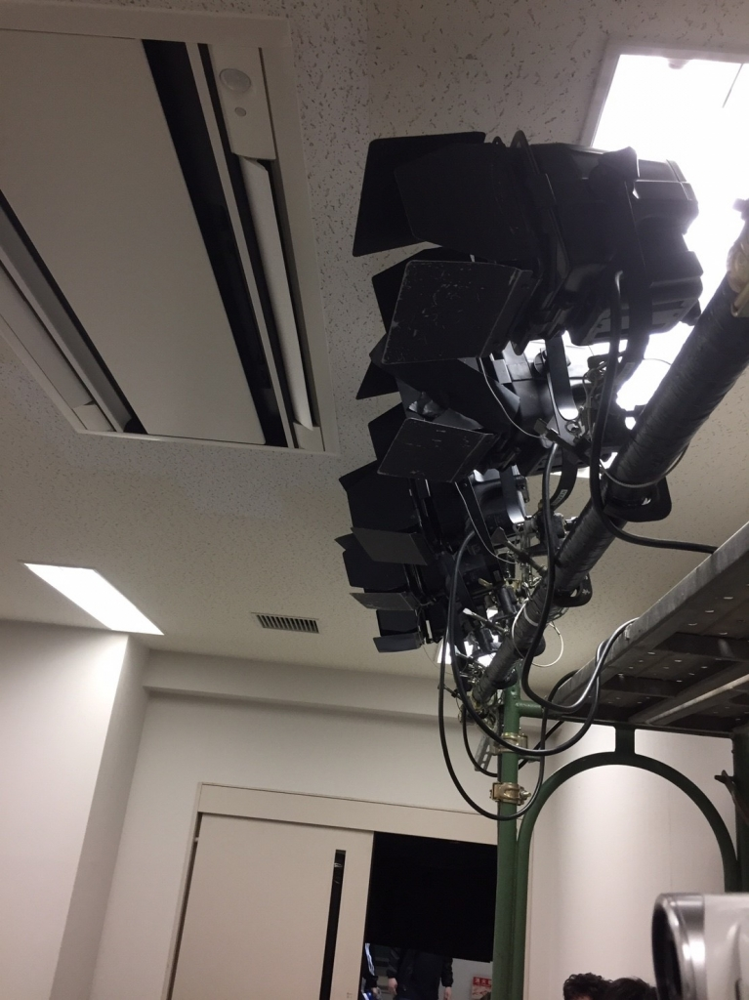

お疲れ様です。今公演では舞台監督をさせていただいている海潮です。

本来であれば昨日書くはずだったのですが、書き損じてしまったため今書かせていただきます。

TC公演は一ヶ月弱と本当に短い公演だと感じます。ですが、短いからこそ鮮烈な公演期間として残るのかなとも感じます。

今公演は万絵巻としては久方ぶりのオムニバス形式となっています。毎年、前座と本公演でオムニバス形式にはなっているのですが、前座とは別に本公演を二本同時に打つのは本当に久しぶりのことだと思います。

オムニバス形式ということで二人の演出がそれぞれの劇を作り上げていますが、二人の一ヶ月弱がそこに詰まっています。

二人が演出に頭を悩ませ、舞台を照明を音響を考え、稽古場で作りたいものを作り上げるために奮闘したこと全てが反映されています。

両方とも万らしいコメディあふれる台本です。
ですが、完成された劇は万らしいコメディであっても全くの別物となっており、それぞれ稽古場で積み上げてきたものが感じられます。

それは間違いなく、人の心拐うドラマになっているはずです。

突き詰めた笑いを是非、当日お客様に感じていただければ幸いです。
