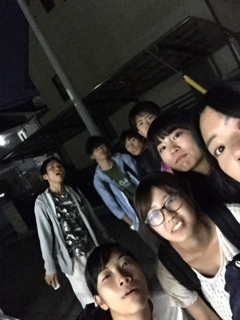

おはこんにちこんばんは、ニキビと激闘中のベルです。

(食欲の秋ですが、皆様食生活の偏りにご注意下さい。)

今日はブレスト…台本や役について話し合いました。

舞台にありそうな具体的なモノ、抽象的なイメージ

や、

各々の役について経歴詳細を確認共有したりなど、

文字上に存在するラジオドッグという台本世界について、

理解や想像が更に深まっていくそんな時間でした！

成程この役はそんな人なんだとニヤけちゃいますね。

これを踏まえて演技に磨きをかけていきたいですね。

さて、私も役者として参加させて頂いている秋公演。

3チームに分かれうたれた部内公演を経た役者布陣。

本当に今年入部なのと疑う位の実力派新入部員から、

確かな役者経験を積んでいらっしゃる先輩方まで、

凄く"強力"でまた"個性的"な人達が集まっています。

そして、そんな濃ゆい面々を引っ張る演出も凄い！

昨年度の文化祭公演でも演出をしていたのですが、

自身、役者スタッフ側から見てて思いました、拘る人だなと！

演じ、創っていて楽しい！と思いっぱなしでした。

し、ご来場下さった皆様に楽しんで頂けたかと存じます。

勿論、今回の公演でもバリバリパリパリとキてます。

その変わらぬ拘り具合に全力で応えたいですし、

そして本番ではお一人でも多くの方に観て頂きたい！

10月7,8日。是非是非芸術創造館へ足をお運び下さい！

本日より予約も始まりましたのでアクセスを！

以上、稽古帰りJagabee買い食い流行中のベルでした。
