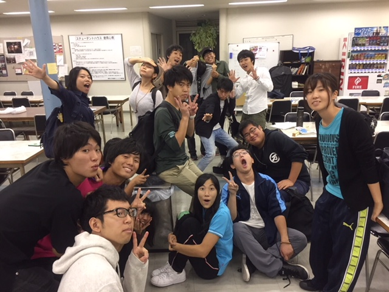

もう秋ですねー、朝は暑い夜は寒いという気温の変化が耐えられなくて僕は体調崩しまくりです。今日のブログはそんな体調崩しがちのデザート風間が担当させていただきます

今回僕は秋で初のサブオペをすることになりました！とても光栄です。とても緊張します。

ところでサブオペをやり始めて一番気になってるのはサンプラー君です。稽古に行くたびにこのおっもたいのを持ち歩くのはほんとに大変ですね。もういっそのこと僕の喉からSEが出れば楽なのになーとか思います笑

それでもサブオペをさせてもらったことはとても嬉しいです！

通しを見るたびに完成していくラジオドッグを見るともう本番が楽しみで楽しみで仕方ありません！

音響、照明、小道具、衣装、他にも見どころいっぱいいっぱいです！是非見に来てください！
��足をお運びください！

なんと今なら、、、、、

[https://ticket.corich.jp/apply/86196/](https://ticket.corich.jp/apply/86196/)

↑こちらで予約もできます。是非予約を今すぐなさって、大阪市立芸術創造館で事件の真相を解き明かしましょう！なお、詳細もそのURLに書かれているのでぜひクリックを！皆さんのご来場を心待ちにしています。

 最近密かにポケモンgoの再ブームが到来しているデイビッドでした。

