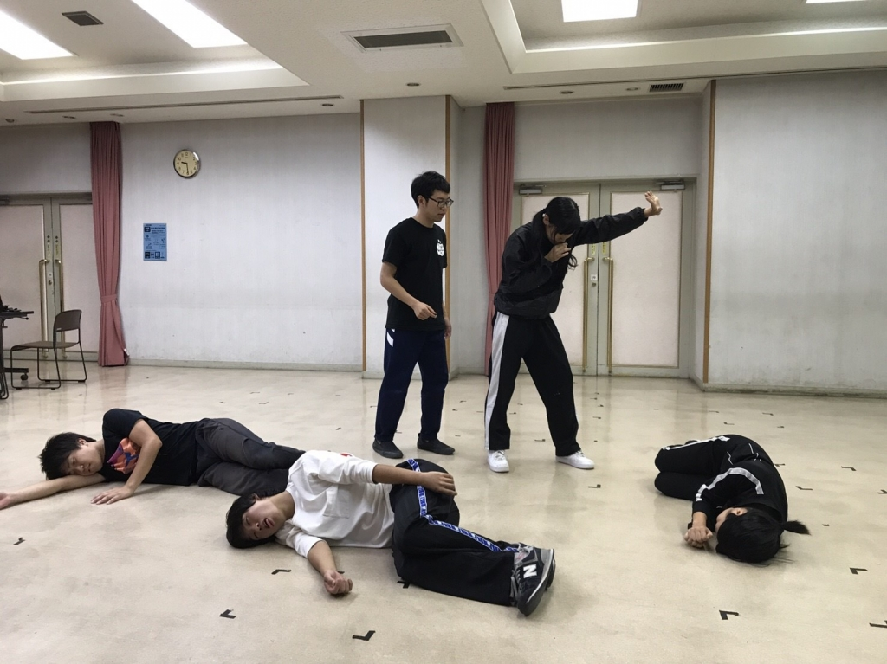

こんばんわ！
最近は急に冷えこんできて夜は寒いくせに昼は暑いって気候に戸惑っています。昨日の外稽古では蝉が鳴いてました。
どうもやおうです！

ついに10月になりましたね。
今年もあと3ヶ月だと思うとなんだか寂しくなります…
ついでにいうと本番まであと6日ですね…
来週の今頃はもう2ステージも終わってると思うと時間が過ぎる早さを感じます。光陰矢の如し。

今日の稽古では昨日の通し稽古のダメ出しをもとに演出と役者で共に意見を出し合いシーン細かな修正をしました。
もう本番も近いのに修正点を見つけると焦りが出てきますね。
しかし、１つずつ丁寧に修正していくと、確実にこの作品が面白くなっていると感じます！
はやくお客様に見せたいなぁという気持ちも日に日に強くなっていきます！
今回は役者全員での動き、パフォーマンスも多くそちらもぜひみていただきたいです！

それでは今日はこのへんで。
劇場で会える日を楽しみにしています！
その日が来るまでみなさまどうかお元気で！
やおうでした！
