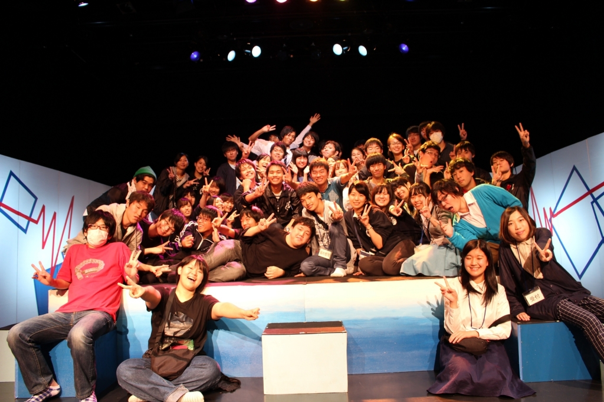

本公演にて制作チーフをさせていただきました3回生のドクトルです。

おかげさまで関西大学劇団万絵巻2017年度秋公演「ラジオドッグ」無事に公演終了となりました。
公演にご来場してくださったお客様、本当にありがとうございます。
劇団員を代表し、心よりお礼申し上げます。

さて、次回の万絵巻の公演ですが、12月8日、9日、10日に劇団万絵巻2017年度卒業公演「朧の森に棲む鬼」を行います。
これからも万絵巻一同精進してまいりますのでまたのお越し心よりお待ちしております！
