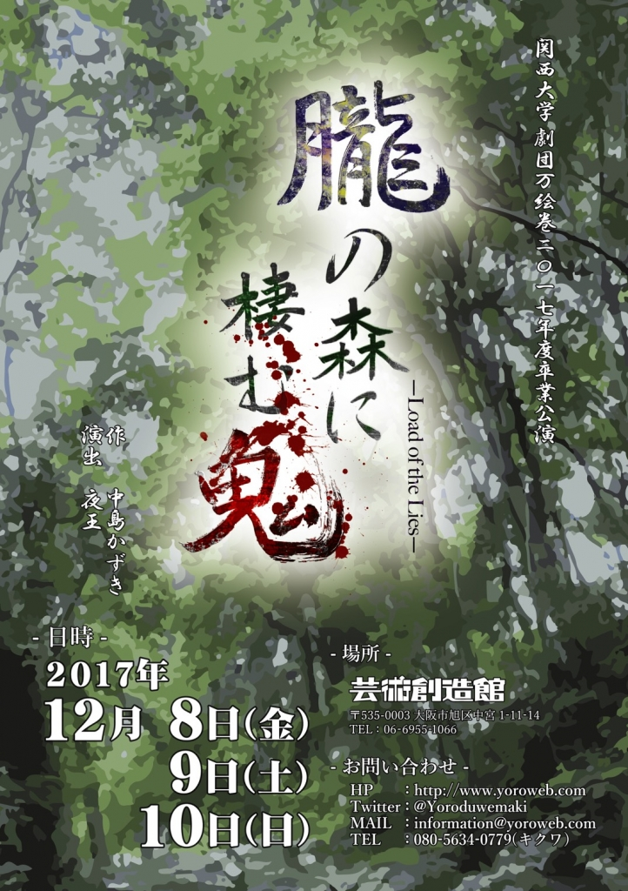

4回生のジミーです！

　 季節の変わり目いかがお過ごしでしょうか？万絵巻は秋公演も終わって、季節の変わり目。そして世代の変わり目でもある卒業公演に突入しました。

　 「始まりがあれば終わりがある」なんて言葉がありますが、やっぱり終わりが見えてくると悲しいものですね。

今回上演させていただく台本も「始まって終わる」一人の男の栄枯盛衰を描いた作品です。僕ら21期生なりに、そして僕自身の一つの青春の終わりを、有終の美を飾れたらなと思っています。

自分の大好きな万絵巻で、大好きな同期や後輩と共に、大好きな劇団の台本で終われることを誇りに思います。

堅苦しい文言はここまでにして、今日は役者選考二日目でした！カレーは二日目が美味しいのがセオリーですが、こちらも二日目。初日でコツを掴んだ役者達が虎視眈々といい役を狙って、一種の演技合戦が行われる戦場でした。二日目でこれだったら、残りの稽古はどうなるんだ！？あの手この手で笑いや泣き、熱血を入れてくる役者陣に楽しみが隠しきれません。

これから二ヶ月間57名の劇団員と共にラストスパートを全力で駆け抜けます！往年の万絵巻ファンの方も、万絵巻知らない人も、きっと見に来てくださいね！(^O^)

以上、仮面ライダー龍騎の最終回は劇場版派のジミーでした！！See you next time,bye bye.

P.S.茹でピーナッツって世界一美味しい落花生の食べ方だと思うんですが、どうでしょう？
